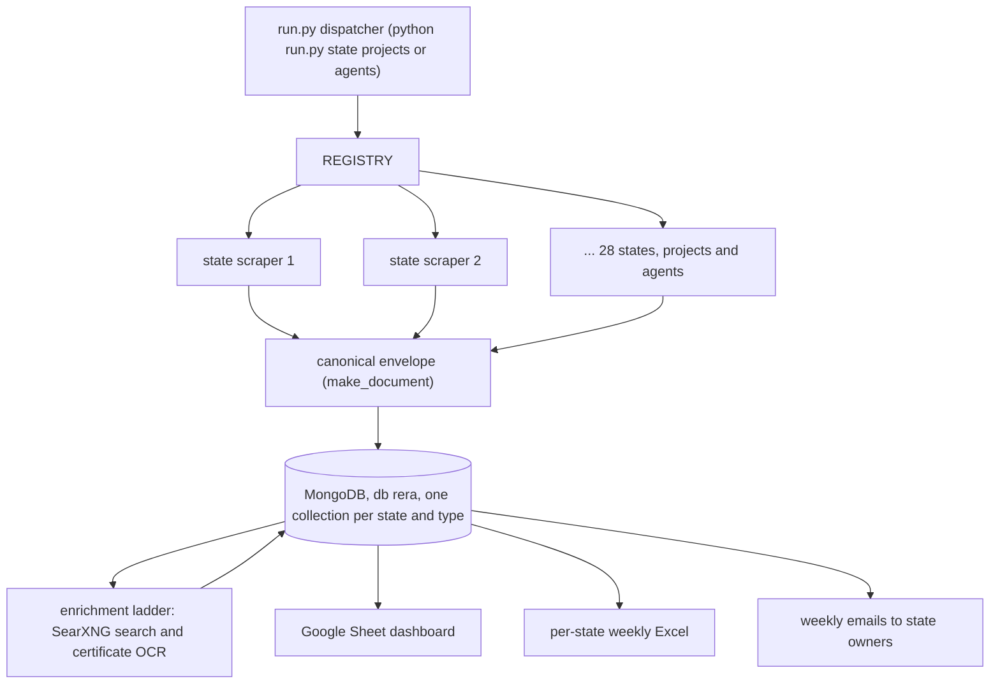

# RERA Data Platform

A registry-driven platform of state-by-state scrapers that builds and maintains a
live database of India's real-estate regulatory filings. Under RERA (the Real
Estate Regulation Act), every state and union territory runs its own portal where
developers register projects and agents register themselves. There is no national
API and no two portals are alike. This platform consolidates 28 of them into one
MongoDB database on a single canonical schema, refreshed automatically every week.

This repository is a design write-up. The production scrapers are private; a small
illustrative snippet of the canonical document shape is included under `sample/`.
There are no credentials anywhere in this project because the portals are public
(no logins), which is also why it can be shared as a case study at all.

## Scale

- **28 states and union territories** covered by their own self-contained scraper.
- **About 265,000 records**: roughly 146,000 registered projects and 119,000
  real-estate agents, all normalised into one schema.
- **About 29,000 lines of Python**, one shared conventions document, and a per-
  scraper dossier for every state.
- **Refreshed weekly, unattended**, then delivered as a Google Sheet dashboard,
  per-state Excel reports, and emails to the people who own each state.

## Why this is hard

Every portal is a different piece of software with a different way of hiding its
data. The platform had to defeat all of these, each with a plain-HTTP replica of
the browser where possible and a headless browser only where not:

| Portal technology | States (examples) | How it is read |
|---|---|---|
| Signed JSON API (HMAC) | Odisha | Reproduce the request signature; send a signed guest auth envelope |
| ASP.NET WebForms (ViewState / postback) | Bihar, Chhattisgarh, Uttar Pradesh | Drive the postback cascade; carry ViewState between requests |
| Angular single-page app | Odisha, Madhya Pradesh | Read the JSON API behind the SPA; capture hidden XHRs via DevTools |
| Laravel / Inertia SPA | Kerala | Follow the Inertia partial-page protocol |
| Captcha-gated search | Punjab, Goa, Telangana | Solve with ddddocr; then list-then-detail (below) |
| Certificate PDFs | Karnataka, Assam | Parse the PDF; OCR handwritten Form-G where needed |
| PublicDashboard AJAX | Himachal Pradesh | Call the dashboard's own AJAX endpoints |
| Legacy-TLS host | West Bengal | A custom TLS adapter, or the handshake fails |
| Selenium new-tab detail | Uttar Pradesh (agents) | The detail opens in a new tab on a scripted click; only a real browser works |

## Architecture

### One dispatcher, many self-contained scrapers
A single `run.py` dispatches to any state: `python run.py karnataka agents`,
`python run.py --all` runs everything, `python run.py --list` prints the coverage
matrix. Each state is exactly two files where finished (projects and agents), each
fully self-contained and runnable on its own, and each registered in a central
REGISTRY so a master runner can iterate all of them and a future GUI can map a
button to a `(state, type)` pair. Every target runs in its own subprocess,
deliberately: one crash cannot kill the batch, and no scraper can leak global state
into the next.

### One database, one canonical shape
Everything lands in a single MongoDB database (`rera`), one collection per state
and type (`karnataka_agents`, `maharashtra_projects`, and so on). Every document,
whatever the portal, uses the same envelope: a raw list layer and detail layer
exactly as the portal served them, plus a normalised layer with a uniform 37-field
agent schema and 38-field project schema. Downstream code (the exporter, the sheet,
the emails) reads only the normalised layer and never has to special-case a state.
See `sample/envelope.py` for the shape.

## The conventions (why re-runs are safe)

Thirteen numbered engineering conventions apply to every scraper and are enforced
retroactively: when a new state teaches a new lesson, it becomes a rule and every
earlier state is revisited. The ones that matter most:

- **Idempotent, merge-safe, resumable.** Every write is an upsert on a stable
  unique id with a unique index, and a re-fetch never blanks a field that already
  has a good value. A re-run backfills what is missing and changes nothing else, so
  running weekly is safe and an interrupted run simply resumes.
- **Stable unique ids from immutable source coordinates**, never from parser
  output. Keying on a value the parser derives means fixing a parse bug gives every
  corrected record a new id and inserts duplicates instead of updating.
- **A blank beats a lie.** A field is left empty rather than filled with a guess;
  canonicalisation (for example phone numbers) prefers a correct blank to a
  confident wrong value.
- **Not done until verified in the database.** A scraper is not finished when it
  runs without error; it is finished when its data is checked in MongoDB for
  envelope conformance, schema, fill rates and validity.

## Captcha portals: list-then-detail, never id-iteration

Where a portal gates search behind a captcha, the pattern is: find the real search
XHR (the visible form action is often a decoy that returns 500), solve the captcha
with ddddocr, pull the full result list once, then fetch each record's detail,
which is almost always captcha-free. Guessing or iterating internal record ids is
explicitly avoided because it silently misses whole categories of record. This one
pattern, refined on Punjab, ports to every captcha portal, and district or category
sub-chunking beats session tokens that expire mid-run (Telangana: 10,998 projects,
99.9 percent with registration numbers, gathered a few hundred at a time).

## Filling in the contacts that portals do not publish

Many portals list a project or agent but not a reachable contact. Two enrichment
sources close that gap, gated so they never overwrite a real portal value:

- **Web search enrichment** via a self-hosted SearXNG metasearch engine on Docker,
  about 17 times faster than the single-engine client it replaced, with
  confidence-gated writes (a match is only promoted to a contact field when domain
  and name evidence agree) and a weekly-then-monthly retry policy that cut
  redundant searches per run from over 5,000 to about 50.
- **Certificate OCR** for portals whose only contact is a handwritten Form-G inside
  a scanned certificate PDF: a vision model reads it, and cross-record duplicate
  detection plus per-field validation catch and purge fabricated values (a vision
  model invents plausible phone numbers when it cannot read one, and the same
  fabricated number appearing for several agents is the giveaway).

## Verification is a separate question from correctness

A dedicated verification tool asks "is what we captured correct" (unit ratios,
schema, id uniqueness, fill rates) and a coverage audit asks the different question
"is there something on the source we never looked at". Both of the worst defects
ever found were missing data that passed every structural check: a paginated grid
that returned only page one (silently losing 27 percent of rows) and fields sitting
at zero fill that turned out to be published after all. The rule now: a zero-fill
field is a task, not a fact, until the source is checked.

## Automation and delivery

A single scheduled weekly run scrapes every state, then syncs a Google Sheet
dashboard, writes a per-state Excel of the week's new registrations, and emails each
state's owner over SMTP. Deltas are exact, driven by a stored watermark of when each
report was last sent rather than a fixed window, because a full run can take hours;
and a freshness guard aborts the send rather than mailing a stale report if the
export step failed.

## What is in this repo

| Path | What it shows |
|---|---|
| `sample/envelope.py` | The canonical document envelope and the merge-safe upsert idea |

The scrapers themselves, the enrichment engine and the delivery scripts are
private.

## Tech stack

Python, MongoDB (PyMongo, unique indexes, merge-safe upserts), requests and httpx
sessions, BeautifulSoup and lxml, Selenium (including Chrome DevTools Protocol
capture) and Playwright where a real browser is unavoidable, ddddocr for captchas,
pdfplumber and PyMuPDF with Tesseract and vision OCR, a self-hosted SearXNG on
Docker, and Google Sheets plus SMTP for delivery.
